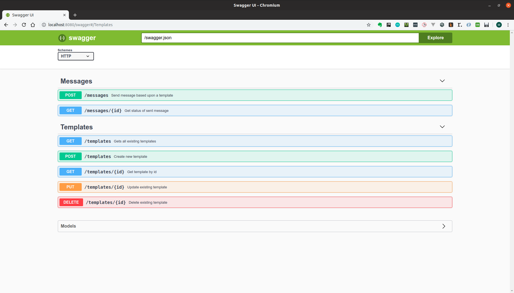
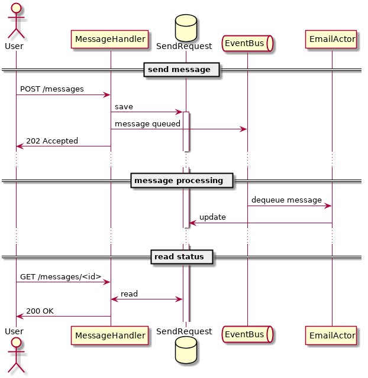

# TeS - Template Service

A simple component for managing communications with our customers: a templating service, developed as a coding exercise as per the specification [here](https://github.com/adrianhj/be-template-svc-challenge).

## Build

To build the application just run:

`mvn clean install`


## Build Docker Image

To build the application bundled in a docker image run:

`mvn clean install -Pdocker`

Or if you want to run without building locally, just pull the image:

`docker pull lucas1000001/tes:latest`


## Run

To run the application execute the following command:

`java -jar target/tes-1.0.0-SNAPSHOT.jar server config.yml`

Or alternatively to run the docker image:

`docker run -p 8080:8080 lucas1000001/tes:latest`


## Example Request

#### 1. Create Template

First we must create a template:

```
curl -X POST "http://localhost:8080/templates" -H "accept: application/json" -H "Content-Type: application/json" -d "{ \"format\": \"MUSTACHE\", \"body\": \"Hello {{thing}}!\", \"channels\": [ \"SMS\", \"EMAIL\", \"PIDGEON\" ]}"
```

From the response grab the template uuid:

```
{
  "id": "d13f53ee-69f6-457c-8390-d89809f3633a",
  "format": "MUSTACHE",
  "body": "Hello {{thing}}!",
  "channels": [
    "PIDGEON",
    "SMS",
    "EMAIL"
  ]
}
```

#### 2. Send Message

Using this uuid, we can then send a message down one of allowed channels:

```
curl -X POST "http://localhost:8080/messages" -H "accept: application/json" -H "Content-Type: application/json" -d "{ \"template\": \"d13f53ee-69f6-457c-8390-d89809f3633a\", \"metadata\": { \"thing\": \"world\" }, \"destination\": { \"channel\": \"EMAIL\", \"deliveryInfo\": { \"email\": \"x.y@z.com\" } }}"
```

Depending on the type of channel used, different delivery info will be required. The table below summarizes the required fields:

| Channel | Field     | Description |  
| ------- | -----     | ----------- |
| EMAIL   | email     | The email address of the recipient   |
| SMS     | mobile    | The phone number of the recipient    |
| PIDGEON | latitude  | Latitude co-ordinate of destination  |
| PIDGEON | longitude | Longitude co-ordinate of destination |

#### 3. Check Status

Again we will be given an identifier for the request. We can check the status of the request using this:

```
curl -X GET "http://localhost:8080/messages/d13f53ee-69f6-457c-8390-d89809f3633a" -H "accept: application/json"    
```

The response will contain the status of the message. Depending on the channel this may take longer to pass or have a higher likelihood of failing:

```
{
  "id": "6e85bbf4-b58b-428c-9b62-71f209035e9f",
  "status": "SENT",
  "template": "d13f53ee-69f6-457c-8390-d89809f3633a",
  "metadata": {
    "thing": "world"
  },
  "destination": {
    "channel": "EMAIL",
    "deliveryInfo": {
      "email": "x.y@z.com"
    }
  }
}
```

## API / Swagger

To use the application, you can check out the API using the swagger UI:

`http://localhost:8080/swagger`

A snapshot of this is shown below:




## Why Akka? / Why Async?


 The implemenation of a message handler has been represented as an asynchronous service, because in reality we'd likely want to decouple the request to send an event, and the actual work done to send an event. For example, having a limited resource - such as
 a pool of carrier pidgeons - would likely mean messages backing up until a resource was freed to send the message.
 
 In a real scenario we'd probably be looking at using queuing middleware such as RabbitMQ or SQS, but in this
 implementation Akka provides a convenient and lightweight model that decouples in a similar way.

The diagram below shows the asynchronous flow:



